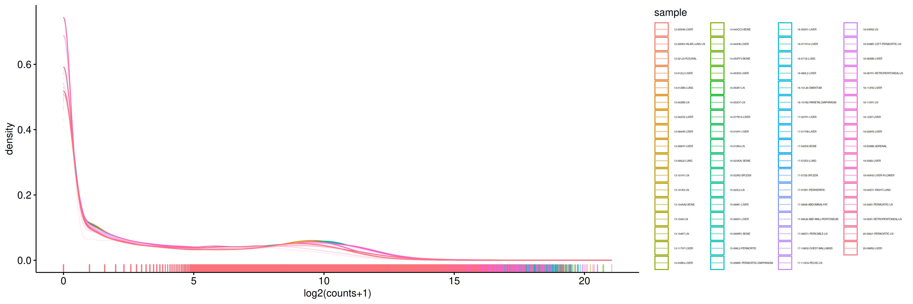

# RNA-qc

*Guidelines on RNA-seq QC steps, using `bash` and `R` (`Python` examples will be added later).*

*QC metrics useful to assess the quality of the RNA-seq experiment, or to detect outliers.*

## MultiQC
> [!NOTE]
> We assume you ran STAR or you have access to the STAR alignments.

#### Run `CollectRnaSeqMetrics` on STAR genome alignments, and use `MultiQC` to summarize them.

Code snippet for UBELIX users:
```
java -Xmx15G -jar /storage/research/dbmr_luisierlab/resources/local/picard_2.25.2/picard.jar CollectRnaSeqMetrics \
 REF_FLAT=/storage/research/dbmr_rubin_lab/pipeline/ref/anno/hg38/gencode.v48.primary_assembly.annotation.refFlat \
 RIBOSOMAL_INTERVALS=/storage/research/dbmr_luisierlab/resources/ref/hg38/GRCh38.primary_assembly.genome.rRNA.interval_list \
 REFERENCE_SEQUENCE=/storage/research/dbmr_luisierlab/resources/ref/hg38/GRCh38.primary_assembly.genome.fa \
 STRAND_SPECIFICITY=SECOND_READ_TRANSCRIPTION_STRAND \
 INPUT=star/sampleX.Aligned.sortedByCoord.out.bam \
 OUTPUT=star/sampleX.rnaseq_metrics.txt \
 VERBOSITY=ERROR
```
> [!NOTE]
> * 16G suffices
> * The above `STRAND_SPECIFICITY` is the most common for Illumina PEs nowadays. You can double-check it by looking at STAR `ReadsPerGene.out.tab` files (if you generated them using `--quantMode GeneCounts`; this info will also be picked up by `MultiQC`, see below), or by visualising the alignments in IGV over a few random genes.

> [!TIP]
> * On UBELIX take advantage of `--qos job_cpu_preemptable`, especially if you have many samples.

#### Run `MultiQC`
```
module load MultiQC
multiqc star
```

> [!NOTE]
> Inputs to `MultiQC` are directories that contain logs and results supported by it. `MultiQC` will scan all the files and look for known reports. In the above case, it will also automatically fetch STAR logs. If you generated FastQC reports before, provide their location as well. See usage details [here](https://docs.seqera.io/multiqc/getting_started/running_multiqc).


## RNA-seq counts QC in R

> [!NOTE]
> We assume `counts` is a dataframe of the raw RNA counts (rows are genes, columns are samples).

#### Plot counts densities
```
counts_log2_long <- reshape2::melt(as.matrix(log2(counts + 1)), value.name = "log2_counts", varnames = c("gene", "sample"))

ggdensity(counts_log2_long, x = "log2_counts",
          color = "sample",
          rug = TRUE,
          xlab = "log2(counts+1)") +
    theme(legend.position = "right",
          legend.direction = "vertical",
          legend.text = element_text(size = 3))
```


*Example of a density plot of raw counts*

#### Define reliably expressed genes (remove genes with low counts)

Checking the fraction of low-expressed genes in your dataset can be useful as a global QC metric or for detecting outliers. Expectations depend on the library type (total RNA, or polyA capture), sequencing depth, etc.

In principle, you don't need to remove low-expressed genes when using modern tools for differential gene expression analysis, like `DESeq2` or `EdgeR`, as these tools handle count distributions, and the low-count genes will generally result with bad p-values. Nevertheless, it is recommended to remove low-expressed genes to avoid false positives, avoid `NA` values in the results, and reduce computational resources.

Basically, we want to fit a 2-component Gaussian distribution over log counts. The approach is similar to Python's `GMMchi`. We will describe two methods in `R`: `dpGMM` and `mclust`.

> [!NOTE]
> `mclust` is simpler to run, and it seems to be a bit more lenient in defining low-expressed genes (resulting in slightly fewer low-expressed genes).

**mclust**
```
library(mclust)

# Because some samples might fail to converge or lack a clear bimodal signal, wrap the execution in a tryCatch block to prevent the loop from breaking.
mclust_fit <- sapply(colnames(counts), function(sample) {
	cat(sample, "\n")
	sample_vector <- setNames(log2(counts[[sample]] +1), rownames(counts))
	tryCatch({
		# Fit model strictly with 2 components
		Mclust(sample_vector, G = 2, verbose = F)
		}, error = function(e) {
		message(paste("Warning: Sample", sample, "failed to fit. Skipping..."))
		return(NA)
	})
}, simplify = F)

# Clustering results (1=background, 2=foreground) will be in: mclust_fit[[sample]][["classification"]]
```
> [!NOTE]
> * Mclust results will be in the `mclust_object[["classification"]]`
> * 1 = gene with an unreliable expression level (too low)
> * 2 = gene with a reliable expression level

Example of downstream filtering:
```
# Convert mclust results into a "count" matrix consisting of `TRUE`/`FALSE`
mclust_fit.cluster.df <- data.frame(sapply(colnames(counts), function(sample) {
	ifelse(mclust_fit[[sample]][["classification"]] == 1, FALSE, TRUE)
}))

# Filter the count table
# Keep genes that are TRUE in at least 3 samples
mclust_fit.filtered_genes <- rownames(mclust_fit.cluster.df)[rowSums(mclust_fit.cluster.df) >= 3]
```
> [!NOTE]
> The thresholds and rules for removing genes from the count table are up to you. Depends on the number of samples, the number and sizes of the comparison groups, etc.

**dpGMM**
```
# Configure model options (e.g., using default 1D options)
gmm_opts <- GMM_1D_opts

# ENFORCE A HARD 2-COMPONENT LIMIT
gmm_opts$KS <- 2 # Set KS to 2 for exactly 2 components
gmm_opts$max_iter <- 10000
gmm_opts$plot <- FALSE
# Restricting K_min and K_max bypasses its internal selection rules (such as Likelihood Ratio testing or ICL-BIC penalties)
gmm_opts$K_min <- 2 # Force at least 2 components
gmm_opts$K_max <- 2 # Force at most 2 components
gmm_opts$run_selection <- FALSE # Turn off AIC/BIC automated searching
gmm_opts$fixed <- T # Set to TRUE to lock the model to exactly 2 components
gmm_opts$quick_stop <- T # Should be TRUE by default, but it's not. Determines if stop searching of the number of components earlier based on the Likelihood Ratio Test. Used to speed up the function.


# Because some samples might fail to converge or lack a clear bimodal signal, wrap the execution in a tryCatch block to prevent the loop from breaking.
# Initialize data structures to store thresholds and binary calls
gmm_fit <- sapply(colnames(counts), function(sample) {
	cat(sample, "\n")
	sample_vector <- log2(counts[[sample]] +1)
	tryCatch({
		# Fit model strictly with 2 components
		runGMM(X = sample_vector, opts = gmm_opts)
		}, error = function(e) {
		message(paste("Warning: Sample", sample, "failed to fit. Skipping..."))
		return(NA)
	})
}, simplify = F)

# Clustering results (1=background, 2=foreground): gmm_fit[[sample]][["cluster"]]
# Clustering split: gmm_fit[["PM154C1"]][["threshold"]]
# Plot: gmm_fit[[sample]][["fig"]]

# add gene names to clust results for convenience:
for (sample in colnames(counts)) {
	names(gmm_fit[[sample]][["cluster"]]) <- rownames(counts)
}

# Convert gmm_fit results into a "count" matrix consisting of `TRUE`/`FALSE`
gmm_fit.cluster.df <- data.frame(sapply(colnames(counts), function(sample) {
	ifelse(gmm_fit[[sample]][["cluster"]] == 1, FALSE, TRUE)
}))

# genes that are TRUE in a at least 3 samples
gmm_fit.filtered_genes <- rownames(gmm_fit.cluster.df)[rowSums(gmm_fit.cluster.df) >= 3]
```
